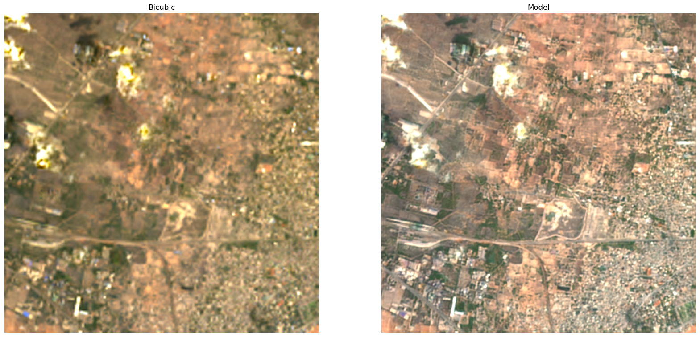

# Deep-Harmonization
Code for "Deep Learning-based Harmonization and Super-Resolution of Landsat-8 and Sentinel-2 images" [paper](https://www.sciencedirect.com/science/article/pii/S0924271624001850).



## Table of Content
* [Abstract](#abstract)
* [Installation](#installation)
* [Usage](#usage)
* [Pretrained models](#pre-trained-models)
* [Inferencing](#inferencing)
* [Feedbacks](#feedbacks)


## Abstract
Multispectral satellite images of the Earth’s surface are used in various applications, ranging from water quality assessment and urban planning to climate monitoring, disaster response, infrastructure oversight, and agricultural surveillance. 
Many of these applications would benefit from higher spatial and temporal resolution of observations, which could be achieved by
combining observations from several different sources. 
In this study, we introduce a deep learning-based pipeline to harmonize the spectral and spatial discrepancies between the Landsat-8 and Sentinel-2 Earth Observation satellites. 
Through established image quality metrics, we demonstrate a significant enhancement in the spatial resolution of Landsat-8 images. 
Field studies show that leveraging unified images from both satellites increases the availability of cloud-free images by up to 60% annually in our area of study. 
Additionally, our pipeline enhances the Normalized Difference Vegetation Index (NDVI) correlation between Landsat-8 and Sentinel-2 observations by an absolute 4.5%, while also offering significant performance gains in a downstream crop segmentation task. 
We demonstrate that our 100M parameter model, which is trained on data from Europe, generalizes to most regions of the world, with only minor limitations. 
Furthermore, we show that the pipeline is able to provide uncertainty estimates for its outputs, which are valuable for decision-making in downstream applications.

## Installation
The [environment.yml](environment.yml) file can be used to clone the conda environment used for the development of this project.
Follow the instructions given below.

```
>> conda env create --file environment.yml
>> conda activate s2l8h
```
The given environment file consists of libraries that are used to process raw rasters, download data from STAC compliant APIs and other visualization libraries, Which are necessary to run the [inference](inference/inference_example.ipynb) examples provided.
It is recommended to build the environment from the given file as there are know inconsistency issues with some source dependency installations from pip.

The project uses the following libraries:

[Pytorch](https://pytorch.org/get-started/locally/) -  Deep Learning model training and inferencing.

[transformers](https://huggingface.co/docs/transformers/installation) - To access the models using hugging face model card.

[YACS](https://github.com/rbgirshick/yacs) - Configuration management.

[ODC-STAC](https://github.com/opendatacube/odc-stac) - access and load Geo Spatial data from STAC compliant APIs.

[Geopandas](https://geopandas.org/en/stable/getting_started/install.html) - Geo Spatial data manipulation.

[Rasterio](https://rasterio.readthedocs.io/en/stable/) -  Raster data handling.

[h5py](https://pypi.org/project/h5py/) -  Dataset file format.


**NOTE** : [BOTO3](https://pypi.org/project/boto3/) is also required to access data from S3 buckets, please set things up as described in the instructions page [here](https://pypi.org/project/boto3/).

## Usage
### Dataset
The models were trained-tested and validated on about 60K Sentinal-2 and Landsat-8 image pairs, the bounds for each pairs can be found in the [meta-data file](training/train_test_validation_patch_extended_final.csv).


### Training
Training configurations are defined in the [config](training/config.py) file.

## Pre-Trained Models
Model cards for pre-trained UNet architectures are created in 🤗(huggingface) 

UNet-6depth-Up+Conv model - [venkatesh-thiru/s2l8h-UNet-6depth-upsample](https://huggingface.co/venkatesh-thiru/s2l8h-UNet-6depth-upsample)

UNet-5depth-Up+Conv model - [venkatesh-thiru/s2l8h-UNet-5depth-upsample](https://huggingface.co/venkatesh-thiru/s2l8h-UNet-5depth-upsample)

UNet-6depth-shuffle model - [venkatesh-thiru/s2l8h-UNet-6depth-shuffle](https://huggingface.co/venkatesh-thiru/s2l8h-UNet-6depth-shuffle)

UNet-5depth-shuffle model - [venkatesh-thiru/s2l8h-UNet-5depth-shuffle](https://huggingface.co/venkatesh-thiru/s2l8h-UNet-5depth-shuffle)

The pretrained models can be called using

```
# Load model directly
from transformers import AutoModel
# UNet-5depth-upsample
model = AutoModel.from_pretrained("venkatesh-thiru/s2l8h-UNet-5depth-upsample", trust_remote_code=True)
l8up = model(l8MS, l8pan)
```
Where
 * `l8MS` - Landsat Multispectral -- Bottom of the Atmosphere (L2) Reflectances
   * The multi-spectral bands are ordered as follows : ['blue', 'green', 'red', 'nir08', 'swir16', 'swir22']
      * The band names are same as what we get from the [USGS's STAC server](https://landsatlook.usgs.gov/stac-server) 
 * `l8pan` - Landsat Pan-Chromatic -- Top of the Atmosphere (L1) Reflectances
   
Better results can be achieved by ensembling the results from all 4 models mentioned above.

## Inferencing
[inference.ipynb](inference/inference_example.ipynb) contains an example inference from a region outside the train-test-validation regime.
The data acquisition depends on the [odc-stac](https://odc-stac.readthedocs.io/en/latest/) library, which inherently fetches the data from AWS s3 buckets of the [landsat STAC catalogue](https://landsatlook.usgs.gov/stac-server). Therefore, it is recommended to set up an AWS credential as described [here](https://pypi.org/project/boto3/).


## Feedbacks
We encourage users currently utilizing Landsat Multi Spectral images within their existing pipelines to use our pipeline for preprocessing those images. 
Following this, we kindly request users share any alterations or variations observed in their Key Performance Indicators (KPIs). 
If any bugs or issues are encountered during this process, please do not hesitate to raise an issue or report them to us for prompt attention and resolution. 
Your feedback is highly valuable to us.

You could reach out to us at : venkatesh.thirugnana@ovgu.de

## Citation Information
If you use this pipeline, please cite our paper

```
@article{sambandham2024deep,
  title={Deep learning-based harmonization and super-resolution of Landsat-8 and Sentinel-2 images},
  author={Sambandham, Venkatesh Thirugnana and Kirchheim, Konstantin and Ortmeier, Frank and Mukhopadhaya, Sayan},
  journal={ISPRS Journal of Photogrammetry and Remote Sensing},
  volume={212},
  pages={274--288},
  year={2024},
  publisher={Elsevier}
}
```
